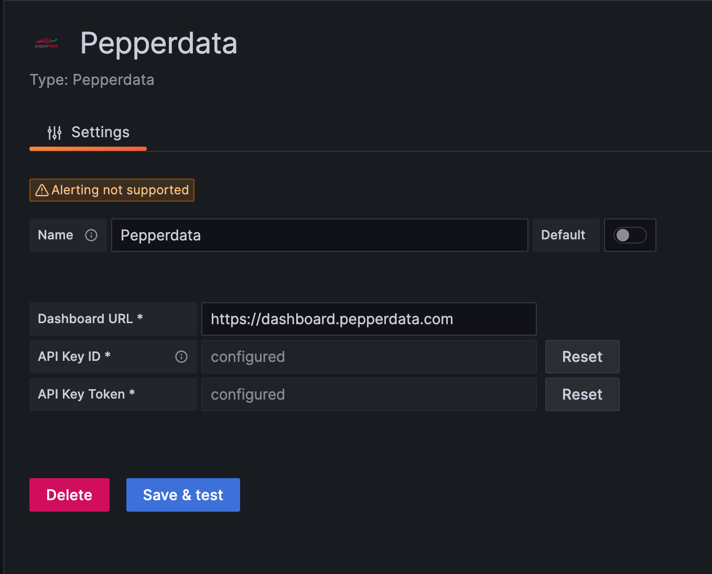
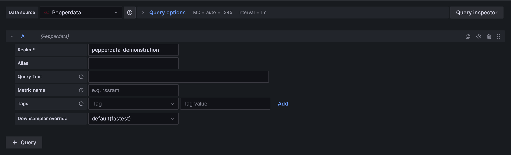

<!-- This README file is going to be the one displayed on the Grafana.com website for your plugin. Uncomment and replace the content here before publishing.

Remove any remaining comments before publishing as these may be displayed on Grafana.com -->

# Pepperdata

Grafana datasource plugin that provides access to Pepperdata dashboard metrics.

## Requirements

- Must have a Pepperdata account (https://dashboard.pepperdata.com).
- Must have generated an API key to allow querying the metrics API (https://dashboard.pepperdata.com/admin/apikeys)

## Getting Started

1. Install the plugin through the Grafana marketplace or through the Grafana cli tool:

   ```bash
   grafana-cli plugins install pepperdata-grafana-datasource
   ```

2. Configure the datasource. You will need to provide the dashboard URL for your deployment (https://dashboard.pepperdata.com by default) and enter your API key ID and token into the respective fields. Click Save and test to ensure the connection is working.

   

## Building metrics queries



Once the datasource is connected, you can start building visualizations using Pepperdata dashboard metrics by using the query editor.

- Realm: this is required so we know which realm to query metrics.
- Alias: an optional label applied to this metrics query that will be displayed in the visualization.
- Query Text: an optional field that lets you build the metrics query manually using query params (see https://help.pepperdata.com/rest-api/zz-metrics/ for more details). If providing a custom query string, the fields below it will be disabled.
- Metric name: provide the name of the metric you want to query.
- Tags: if you want to filter this query by certain tags, provide them here.
- Downsampler override: optionally change the downsampler operator for this query.
